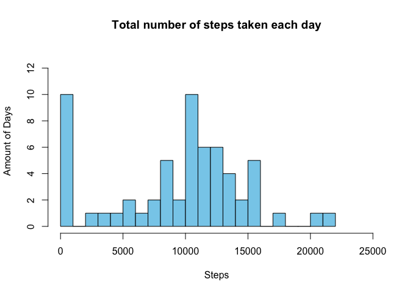
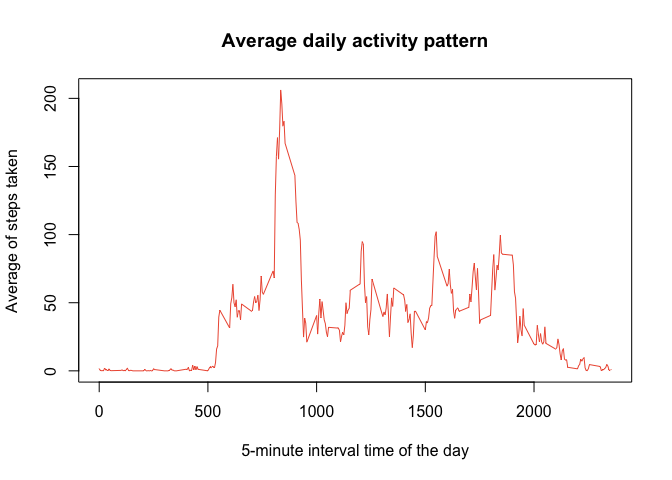
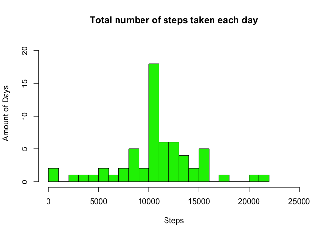
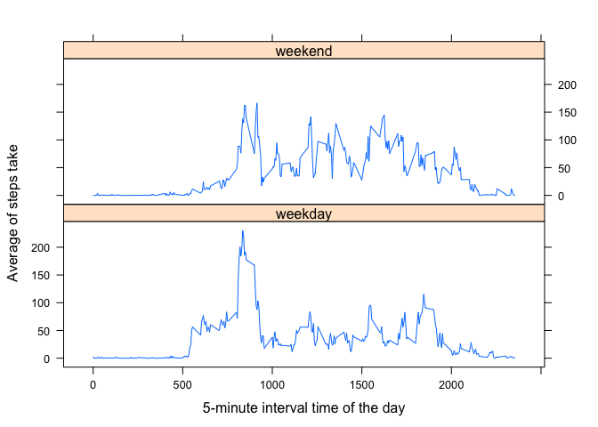

# Reproducible Research: Peer Assessment 1
  **Joan Mariné Boada**
   
  **4th March 2021**

## Introduction

It is now possible to collect a large amount of data about personal movement using activity monitoring devices such as a [Fitbit](http://www.fitbit.com/), [Nike Fuelband](http://www.nike.com/us/en_us/c/nikeplus-fuelband), or [Jawbone Up](https://jawbone.com/up). These type of devices are part of the “quantified self” movement – a group of enthusiasts who take measurements about themselves regularly to improve their health, to find patterns in their behavior, or because they are tech geeks. But these data remain under-utilized both because the raw data are hard to obtain and there is a lack of statistical methods and software for processing and interpreting the data.  

This assignment makes use of data from a personal activity monitoring device. This device collects data at 5 minute intervals through out the day. The data consists of two months of data from an anonymous individual collected during the months of October and November, 2012 and include the number of steps taken in 5 minute intervals each day.

The data for this assignment can be downloaded from the course web site:

- Dataset: [Activity monitoring data](https://d396qusza40orc.cloudfront.net/repdata%2Fdata%2Factivity.zip) [52K]  

The variables included in this dataset are:
  
- **steps**: Number of steps taking in a 5-minute interval (missing values are coded NA).

- **date**: The date on which the measurement was taken in YYYY-MM-DD format.

- **interval**: Identifier for the 5-minute interval in which measurement was taken.  

The dataset is stored in a comma-separated-value (CSV) file and there are a total of 17,568 observations in this dataset.


## Loading and preprocessing the data

We unzip the file and transform the data into a format suitable for our analysis.


```r
unzip("activity.zip")
activity<-read.csv("./activity.csv")
activity$date<-as.Date(activity$date)
activity$steps<-as.numeric(activity$steps)
```


## What is mean total number of steps taken per day?  

1. The first we gonna do is to calculate the total number of steps taken per day:


```r
sum_steps_day<-tapply(activity$steps, activity$date, sum, na.rm=TRUE)
head(sum_steps_day)
```

```
## 2012-10-01 2012-10-02 2012-10-03 2012-10-04 2012-10-05 2012-10-06 
##          0        126      11352      12116      13294      15420
```


2. Now we plot the histogram of the total number of steps taken each day

```r
par(mfrow=c(1,1))
hist(as.numeric(sum_steps_day),
        main="Total number of steps taken each day",
        xlab="Steps",
        ylab="Amount of Days",
        breaks=20,
        col="skyblue",
        xlim=c(0,25000),
        ylim=c(0,13)
     )
```

<!-- -->

We observe that we have a considerable amount of days with few steps, in the first bin. We can suspect that this is due to we have replaced the missing values by zeros. In the third part of the assignment we'll solve this problem.

3. The last step is to calculate the mean and median of the total number of steps taken per day.


```r
mn<-mean(sum_steps_day)
mn
```

```
## [1] 9354.23
```

```r
md<-median(sum_steps_day)
md
```

```
## [1] 10395
```

Hence we have that the mean is 9354.23 and the median 10395.


## What is the average daily activity pattern?

We gonna calculate the mean of steps per day:


```r
mean_steps_interval<-tapply(activity$steps, activity$interval, mean, na.rm=TRUE)
head(mean_steps_interval)
```

```
##         0         5        10        15        20        25 
## 1.7169811 0.3396226 0.1320755 0.1509434 0.0754717 2.0943396
```

Unlike the case of steps per day, now we have removed the NA values because in some days we have data available per interval and some days don't.  


1- Let's make the plot:

```r
plot(unique(activity$interval), mean_steps_interval,
        main="Average daily activity pattern",
        xlab="5-minute interval time of the day",
        ylab="Average of steps taken",
        col="tomato2",
        type="l")
```

<!-- -->

2- Now, we search for the interval that contains the maximum number of steps on average.


```r
interval<-which(mean_steps_interval==max(mean_steps_interval))
interval
```

```
## 835 
## 104
```

Therefore we have that the interval is at AM 8:35, specifically the row 104 of the data set.  

Let's to compute, just for curiosity, how many steps he did in average at this time:

```r
max(mean_steps_interval)
```

```
## [1] 206.1698
```

These computations are coherent with the plot we have draw.


## Imputing missing values

1- We start counting the total number of missing values in the dataset.


```r
sum(is.na(activity))
```

```
## [1] 2304
```

In particular, we can guarantee that all the NA values are in the *steps* variable.


```r
sum(is.na(activity$steps))
```

```
## [1] 2304
```

```r
sum(is.na(activity$interval))
```

```
## [1] 0
```

```r
sum(is.na(activity$date))
```

```
## [1] 0
```

2- We have to devise a strategy for filling in all of the missing values in the dataset. Our strategy will be to use the mean for that 5-minute interval. Notice that we are going to assign in the variable steps values that almost sure are not integer numbers. Maybe this fact hat no sense in some way, but I have preferred so to obtain more exact results with the approximation.  

3- Create a new dataset that is equal to the original dataset but with the missing data filled in.

```r
activity_filled<-activity
aux<-unique(activity$interval)
for (j in 1:nrow(activity)){
    if (is.na(activity[j,"steps"])){
        aux2<-which(aux==activity[j,"interval"])
        activity_filled[j,"steps"]<-mean_steps_interval[aux2]
    }
}
```

4- Let's make a histogram of the total number of steps taken each day

```r
sum_steps_day_filled<-tapply(activity_filled$steps,
                             activity_filled$date,
                             sum)
hist(as.numeric(sum_steps_day_filled),
        main="Total number of steps taken each day",
        xlab="Steps",
        ylab="Amount of Days",
        breaks=20,
        col="green2",
        xlim=c(0,25000),
        ylim=c(0,21)
     )
```

<!-- -->

And now, we calculate the mean and median of the total number of steps taken per day.

```r
mn_filled<-mean(sum_steps_day_filled)
mn_filled
```

```
## [1] 10766.19
```

```r
md_filled<-median(sum_steps_day_filled)
md_filled
```

```
## [1] 10766.19
```

Notice that the median of the *steps* variable is not an integer number, this is due to the approximation we did.  

Let's to compare these values with the previous ones, we begin with the absolute error:


```r
mn-mn_filled
```

```
## [1] -1411.959
```

```r
md-md_filled
```

```
## [1] -371.1887
```

We have leaved the sign of the values to notice that we have an skewness due to the amount of NAvalues that we had in the first bin in the first histogram.  

Finally, the relative error:


```r
(mn_filled-mn)/mn_filled
```

```
## [1] 0.1311475
```

```r
(md_filled-md)/md_filled
```

```
## [1] 0.03447726
```


## Are there differences in activity patterns between weekdays and weekends?


1- Create a new factor variable in the dataset with two levels – “weekday” and “weekend” indicating whether a given date is a weekday or weekend day.


```r
for (j in 1:nrow(activity_filled)){
    if (weekdays(activity_filled[j,"date"]) %in% c("Saturday","Sunday")){
        activity_filled[j,"weekday"]<-"weekend"
    } else {
        activity_filled[j,"weekday"]<-"weekday"
    }
}
```

2- Panel plot containing a time series plot of the 5-minute interval (x-axis) and the average number of steps taken, averaged across all weekday days or weekend days (y-axis).


```r
library(lattice)
activity_weekday<-aggregate(steps~interval+weekday,
                            data=activity_filled, 
                            FUN=mean)
xyplot(steps~interval|weekday,
       data=activity_weekday,
       layout=c(1,2),
       type="l",
       xlab="5-minute interval time of the day",
       ylab="Average of steps take")
```

<!-- -->


